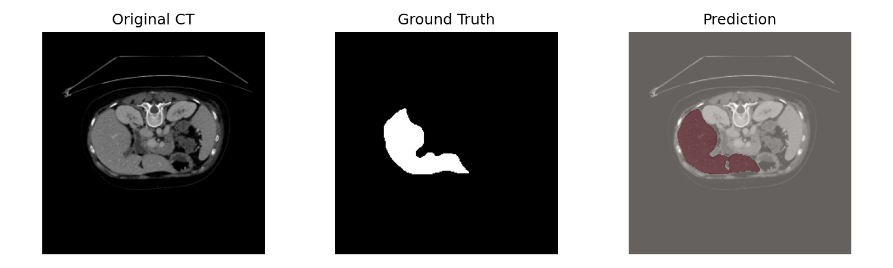
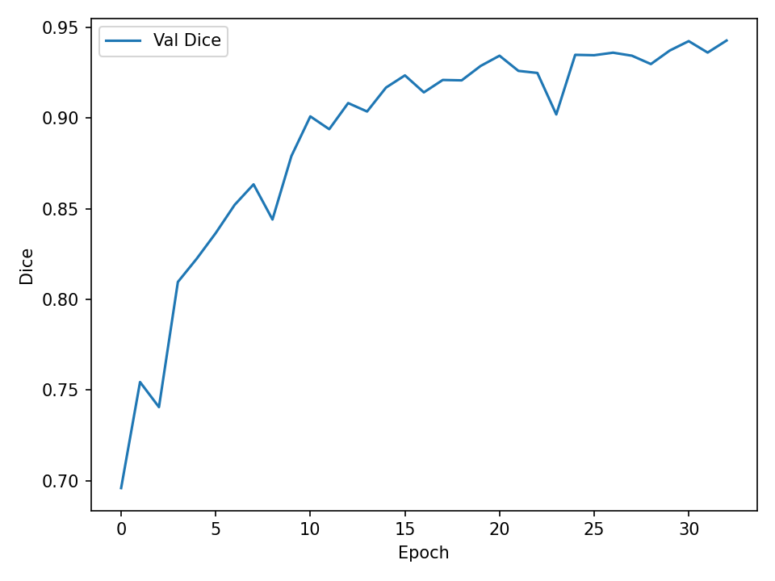
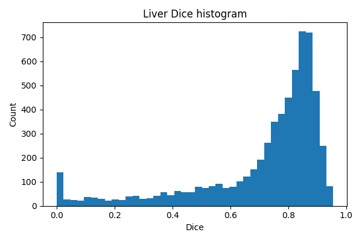
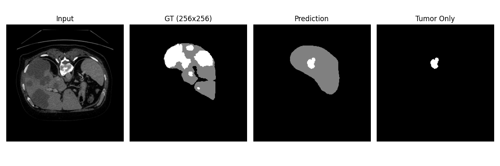
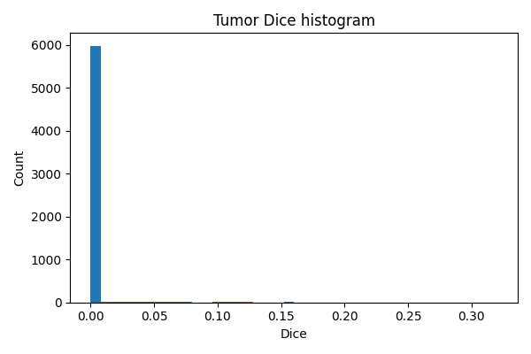

# Cascaded Liver & Tumor Segmentation  
_A full 8-phase CT segmentation pipeline built from scratch._

### Author: Youssef Hamed  
### Status: Completed (liver successful, tumor model documented failure)

---

## 🧩 Project Overview

This project is a complete end-to-end medical image segmentation system for abdominal CT scans.  
The pipeline performs:

1. Data preprocessing  
2. Liver segmentation  
3. Tumor ROI extraction  
4. Tumor segmentation  
5. Full cascade inference  
6. Detailed evaluation and visualization  

I built every part of this project from scratch using:
- Python  
- PyTorch  
- NumPy / SciPy  
- nibabel  
- scikit-image  
- pandas / matplotlib  

### Dataset  
I used the **Liver Tumor Segmentation** dataset from Kaggle (derived from **LiTS**).  
Due to hardware and storage limitations, I used **~50 out of the full 130 CT volumes**.  
The dataset is **not included** in this repository due to licensing and size.

This project contains:
- All preprocessing and modeling scripts  
- ROI extraction utilities  
- Cascade inference tools  
- Evaluation scripts  
- A full final report + short summary  

---

# 📸 Example Liver Segmentation

### 🖼 Input → Ground Truth → Prediction  

  

This shows a full slice with the original CT, GT liver mask, and predicted liver mask.

---

# 📈 Training Curve (Phase 3 – Liver Model)

  

Validation Dice rises steadily → confirms the liver U-Net trained successfully.

---

# 📊 Liver Segmentation Performance

### Liver Dice Histogram  

  

Performance concentrates in the 0.75–0.90 range, with few low-Dice outliers.

---

# 🧪 Example Cascade Result (Liver → ROI → Tumor)

This shows the pipeline output after liver segmentation and ROI extraction.

  

The liver mask is used to crop the region of interest, which feeds into the tumor-stage model.

---

# ❌ Tumor Segmentation Metrics (Documented Failure)

### Tumor Dice Histogram  

  

Most slices score near 0 → the model failed to learn meaningful tumor features.

---

## 🚀 Pipeline Architecture (8 Phases)

### **Phase 1 — Dataset preparation**  
Standardized filenames, validated orientations, checked spacing and shapes.

### **Phase 2 — Preprocessing**  
HU clipping, normalization, resampling, empty-slice filtering.

### **Phase 3 — Liver U-Net training**  
2D U-Net using BCE + Dice loss at 384×384 resolution.

### **Phase 4 — Liver inference**  
Full CT inference with largest connected-component filtering.

### **Phase 5 — Tumor ROI extraction**  
Cropping the liver region to isolate tumor-relevant areas.

### **Phase 6 — ROI validation**  
Alignment checks and mask integrity verification.

### **Phase 7 — Tumor U-Net training**  
Multiple attempts; the model failed to learn meaningful tumor features.

### **Phase 8 — Evaluation**  
Dice metrics, slice detection statistics, best/worst slices, plots, and CSV summaries.

---

## 🧠 What Worked Well

- Reliable liver segmentation  
- Fully functional 8-phase cascade  
- Slice-level and case-level evaluation  
- Clean NIfTI-based workflow  
- Best/worst slice identification  
- Reproducible and well-organized codebase  

---

## ❌ Tumor Segmentation Results (failed)

| Metric | Value |
|--------|--------|
| **Mean Dice** | **0.0029** |
| Median Dice | 0.0 |
| Max | 0.320 |
| Slice Detection Rate | ~34% |

Despite multiple training attempts, the tumor model did not converge due to:
- extremely small tumors  
- heavy class imbalance  
- only ~50 volumes used (instead of 130)  
- limited GPU capacity  
- shallow 2D architecture  
- ROI cropping edge cases  

This failure is documented transparently in the final report.

---

# 🧭 MEVIS Draw (Tool Exploration)

I also tried using **MEVIS Draw**, the medical imaging annotation tool developed by Fraunhofer MEVIS.  
I explored loading CT volumes and viewing slices, but I wasn't yet able to fully operate the tool.  
Even this brief attempt showed me how complex real annotation workflows are, and it made me more
interested in learning MEVIS Draw properly in the future.

  

---

## 🔮 Future Work  
_(planned once I have access to a stronger GPU)_

- Use the **full 130 LiTS volumes** instead of ~50  
- Train deeper architectures (ResNet-U-Net, Attention U-Net, U-Net++, Swin-UNet)  
- Move to 3D U-Nets for volumetric tumor context  
- Increase input resolution (512–576)  
- Use Dice + Focal loss for imbalance  
- Improve ROI strategies and sampling methods  

These changes should significantly improve tumor detection capability.

---

## 🛠 Requirements  
(For users planning to adapt the pipeline to their own dataset)

- Python 3.10+  
- PyTorch  
- numpy  
- scipy  
- scikit-image  
- nibabel  
- pandas  
- matplotlib  
