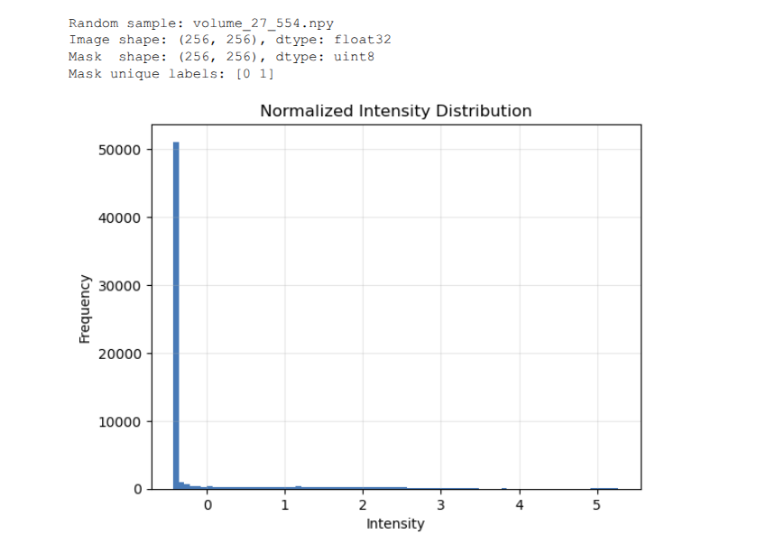
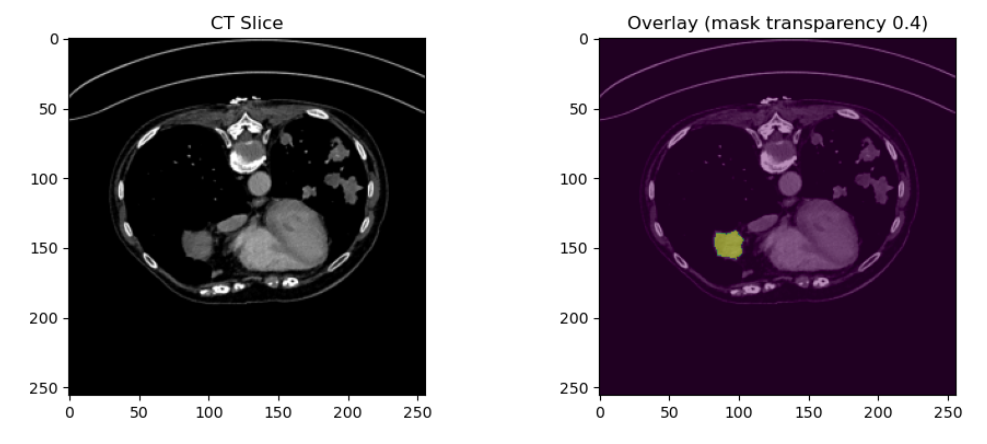
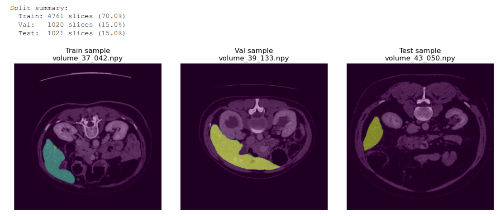

🧠 Phase 2 — Preprocessing & Slice Extraction
Date: 2025-10-25  
Author: Youssef  
Environment: fraunhofer (Python 3.10, SimpleITK + skimage + tqdm)

---

### 🎯 Objective
Transform raw LiTS-style 3-D CT volumes and segmentation masks into clean, normalized 2-D slices for U-Net training.

---

### ⚙️ Method Summary
**Code:** `Code/preprocess_slices.py`

**Input:**
- CT volumes in `data/volume_pt*/`
- Segmentation masks in `data/segmentations/`

**Preprocessing pipeline:**
1. Clip HU range → [−100 , 400]  
2. Z-score normalization per volume  
3. Extract only slices containing liver/tumor  
4. Resize to 256 × 256  
5. Save `.npy` image/mask pairs  
6. Split dataset 70 / 15 / 15 (train/val/test)  
7. Generate QC visualizations

---

### 📊 Results

| Metric | Value / Observation |
|:-------|:--------------------|
| **Paired volumes** | 51 |
| **Total image slices** | 6,802 |
| **Total mask slices** | 6,802 |
| **Shape (image/mask)** | (256 × 256) |
| **Dtype (image/mask)** | float32 / uint8 |
| **Labels** | 0 = background, 1 = liver/tumor |
| **Normalization** | Mean ≈ 0, Std ≈ 1 |
| **Image ↔ Mask match** | ✔ 1-to-1 |
| **Split ratios** | Train: 4,761 (70%) • Val: 1,020 (15%) • Test: 1,021 (15%) |
| **Processing time** | ≈ 1 min 40 s on MX450 |
| **QC notebook output** | ✅ Phase 2 data quality verified successfully |

---

### 🧩 Figures
Include these in your report:

  
*Normalized intensity distribution across slices.*

  
*Visual alignment between CT image and segmentation mask.*

  
*Random examples from Train / Val / Test sets.*

---

### 🧠 Interpretation
- Normalization consistent across all slices.  
- Overlay confirms correct orientation and pixel alignment.  
- Split balance is ideal for training and validation.  
- Dataset is clean, well-structured, and reproducible — suitable for use as a Fraunhofer-style research dataset.  

---

### 📁 Output
data/processed/
├── images/ (float32 normalized slices)
├── masks/ (uint8 segmentation masks)
└── splits/ (JSON files)
docs/figures/
├── preprocessing_preview.png
├── histogram.png
├── overlay.png
└── split_samples.png

---

### ✅ Status
Phase 2 complete — dataset verified and **Fraunhofer-ready for Phase 3 (U-Net baseline training)**.